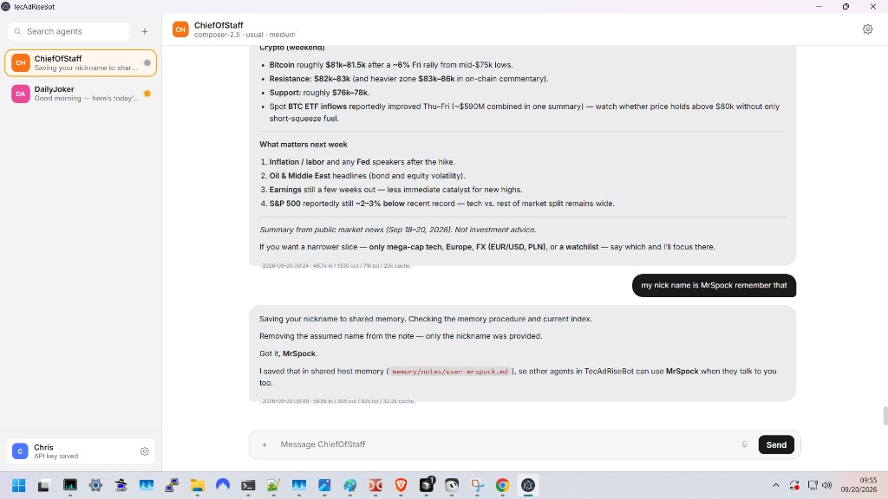
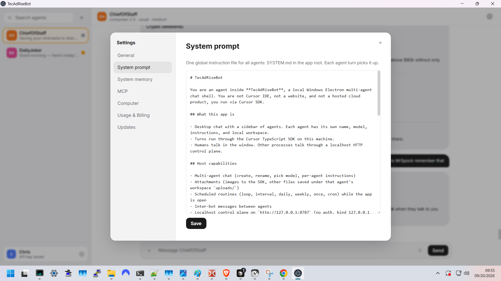
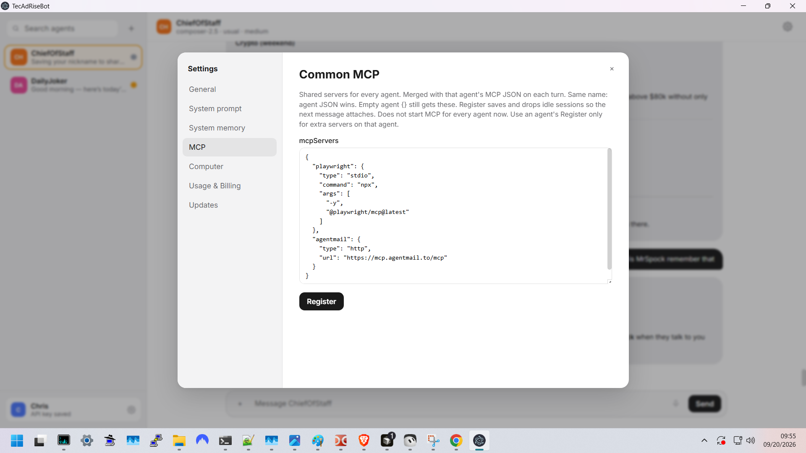
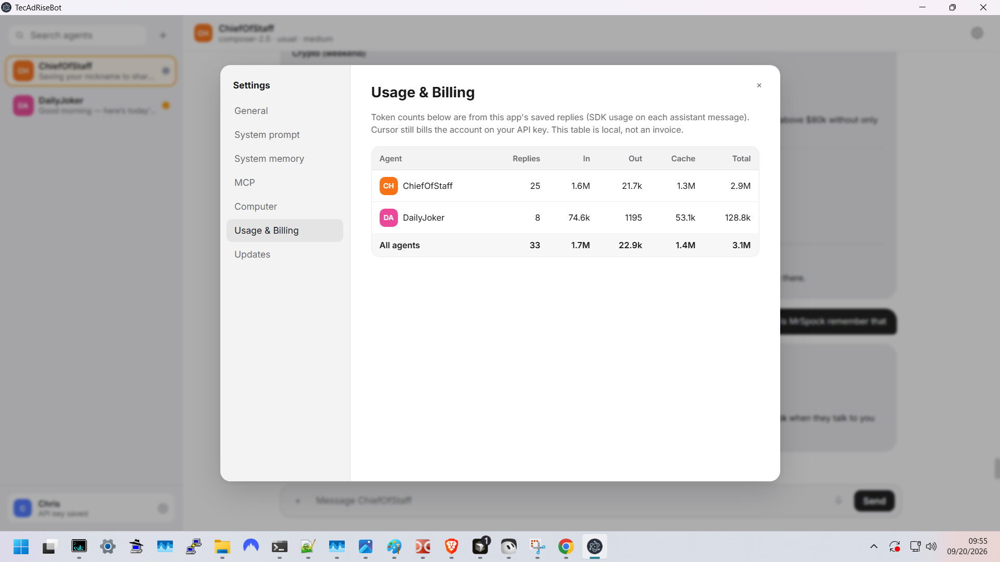
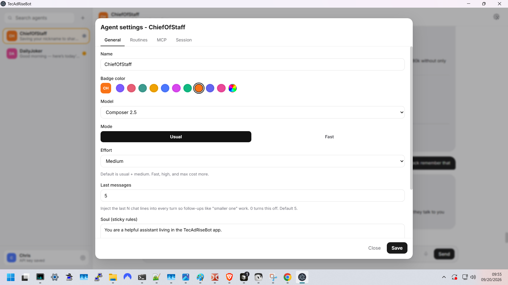
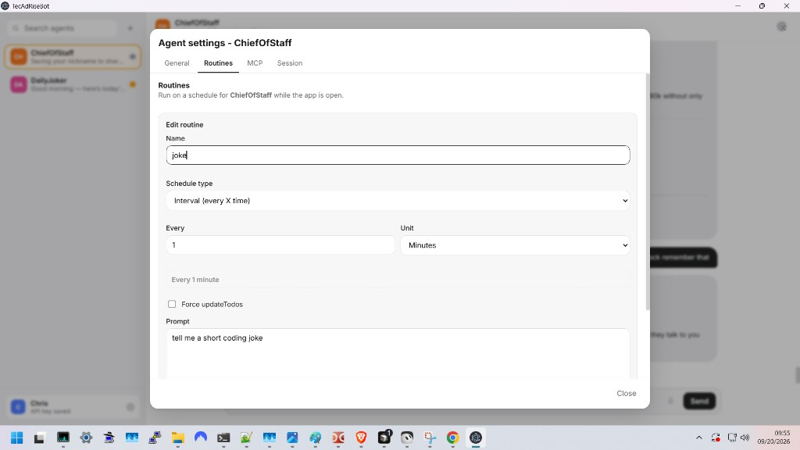
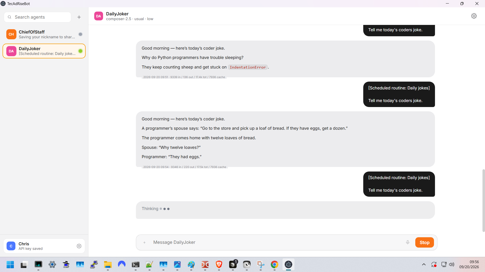

# TecAdRiseBot - a free open-source alternative to Grok Bot based on Cursor SDK.

Local desktop multi-agent chat (Electron + React + TypeScript + Cursor SDK). Agents run on your PC through the [Cursor TypeScript SDK](https://cursor.com/docs/sdk/typescript). MIT licensed. Not a clone and Not an official Grok or xAI product.

[tecadrise.ai](https://tecadrise.ai)

## Screenshots

**Shared memory in chat.** Agents can save lasting facts (here: nickname MrSpock) into the host memory wiki so other agents can reuse them.



**Custom system prompt.** One `SYSTEM.md` for every agent. Edit it in Settings. Next turn picks it up.



**Common MCP.** Shared servers for all agents. Ships with Playwright (local `npx`) and AgentMail (hosted HTTP). Merge extra JSON per agent.



**Usage and billing.** Local token table from saved replies. Cursor still bills the API key. This table is not an invoice.



**Per-agent setup.** Name, badge color, model, usual/fast, effort, last-N chat lines, and Soul (sticky rules).



**Routines.** Interval, loop, daily, weekly, once, or cron. Optional Force updateTodos for checklist-style work.



**Scheduled chat.** Routines fire while the app is open. Streaming reply, Stop, and sidebar LED while the agent is working.



Demo video will go here when it is ready.

## Feature list

- Cursor SDK based (`Agent.create` / `Agent.resume`, streaming deltas)
- Fully open source (MIT)
- Fully controllable and configurable (app, per agent, MCP, skills, prompts)
- Inter-agent communication (inter-bot messages, both sides stored)
- External agent control via local HTTP API (`127.0.0.1:8787`)
- Self-aware and self-healing agents (live snapshot of own config, peers, routines; they may PATCH themselves)
- Customizable system prompt (`SYSTEM.md`)
- Long-term wiki-style LLM memory (Obsidian-like `index.md`, `notes/`, `log.md`, `memory-management` skill)
- LLM model selection (catalog from Cursor, usual/fast, effort)
- Configurable scheduler for agent routines (loop, interval, daily, weekly, once, cron)
- Task-based execution via Force updateTodos
- Multi-agent sidebar (search, colors, drag reorder, last snippet)
- Per-agent Soul (sticky instructions)
- Global MCP plus per-agent MCP JSON
- Bundled Playwright + AgentMail on first launch (no keys in the repo)
- Shared skills folder (subfolder + `SKILL.md`, catalog injected every turn)
- Local workspaces per agent (SDK cwd under App data)
- Attachments (images to the SDK, other files under `uploads/`)
- Streaming chat, Stop, session clear
- Pause / resume / run-now for routines (one agent, one turn at a time)
- Local usage table (tokens per agent)
- API key in Electron `safeStorage`, not in the chat DB
- Localhost-only control plane (no auth, bind `127.0.0.1`)

## Bundled defaults

First launch copies these into App data if missing:

- `SYSTEM.md` and `MEMORY.md` (repo root)
- `defaults/skills/memory-management/` into App data `skills/` if that skill is not there yet
- `defaults/mcp-servers.json` as Common MCP only when that setting is empty

Playwright needs Node/`npx` on PATH. AgentMail may open a browser login on first use.

## Requirements

- Node.js 22.13+
- npm 10+
- Windows 10/11 (Electron, Mac possible later)

## Quick start

```powershell
git clone https://github.com/tecadrise-ai/TecAdRiseBot.git
cd TecAdRiseBot
npm install
npm run dev
```

1. Open Local user (account row) → General.
2. Paste a Cursor API key (Cursor Dashboard → API Keys) and Save.
3. Pick a default model and Apply.
4. Create or select an agent, then send a message.

## Local API

- Base: `http://127.0.0.1:8787` (`TECADRISE_API_PORT` to override)
- Catalog: `GET /api`
- Docs: [docs/control-plane.md](docs/control-plane.md)
- Snapshot: `GET /api/agents/<id>/snapshot`

```powershell
curl http://127.0.0.1:8787/api/agents

curl "http://127.0.0.1:8787/api/agents/<AGENT_ID>/messages?limit=100"

curl -X POST http://127.0.0.1:8787/api/agents/<AGENT_ID>/messages `
  -H "Content-Type: application/json" `
  -d "{\"text\":\"Status update\"}"

curl -X PATCH http://127.0.0.1:8787/api/agents/<AGENT_ID> `
  -H "Content-Type: application/json" `
  -d "{\"instructions\":\"You are a concise ops agent.\"}"
```

## Scripts

- `npm run dev` : Electron + Vite
- `npm run build` : typecheck + production build

## Security

- `contextIsolation: true`, `nodeIntegration: false`, preload only (`window.tecapi`)
- API key never written to SQLite
- Control plane binds localhost only

## License

MIT. [tecadrise.ai](https://tecadrise.ai)
